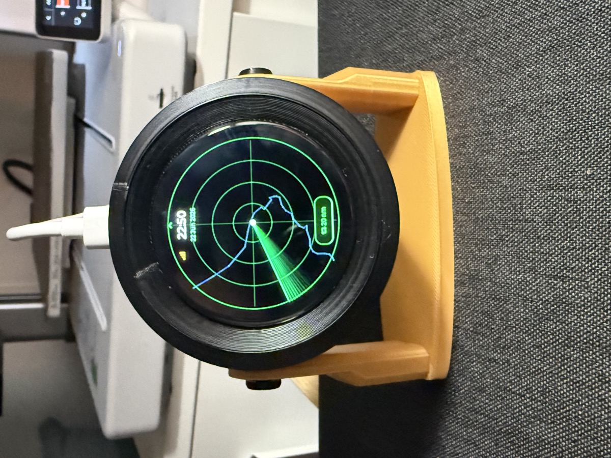
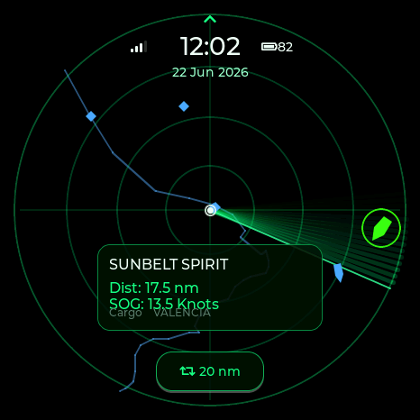
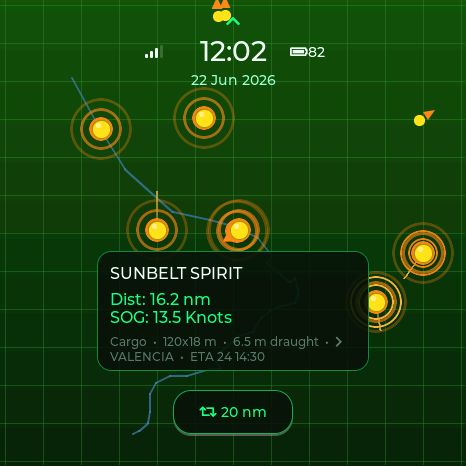
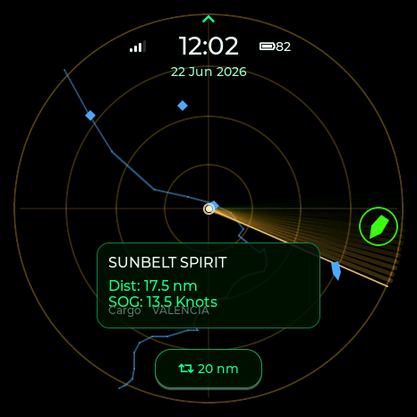
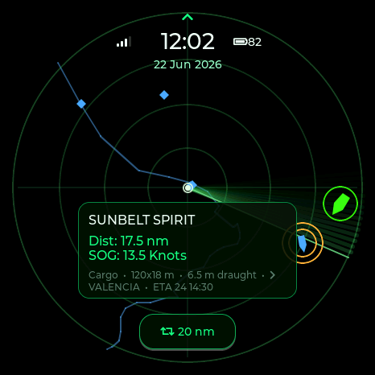
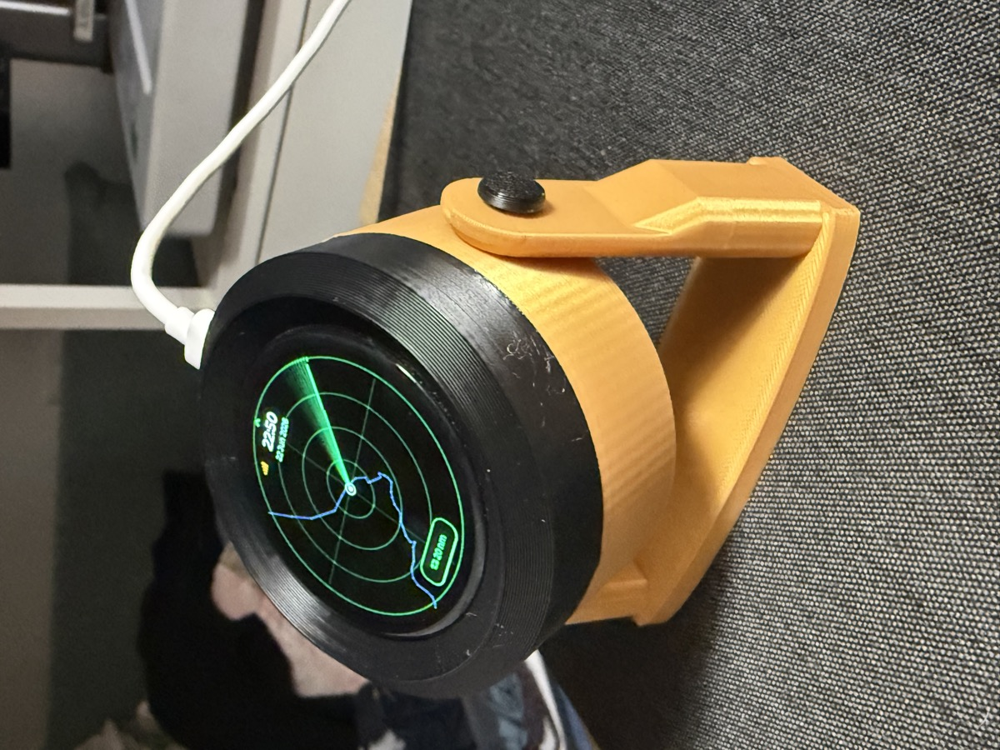

# Capsule Radar — Marine 🚢

<p align="center">
  <a href="https://socquique.github.io/capsule-radar-ais/"></a>
  
  
  
  <a href="https://github.com/socquique/capsule-radar-ais/releases"></a>
  <a href="LICENSE"></a>
  <a href="https://github.com/socquique/capsule-radar-ais/stargazers"></a>
</p>

<p align="center">
  
</p>
<p align="center"><sub>The finished build on its tilt stand — live AIS scope with the coastline, animated sweep, clock and range. Marine sibling of the aircraft Capsule Radar.</sub></p>

A live **AIS ship radar** for the **Waveshare ESP32-S3-Touch-AMOLED-1.75** — a round 466×466 AMOLED with capacitive touch. It pulls nearby **vessels** from a free online **AIS** feed over WiFi and plots them on a touch radar scope centered on your home, harbour, or a spot by a navigable river/canal — useful by the sea **and** inland. It's the **marine sibling of [Capsule Radar](https://github.com/socquique/capsule-radar)** (the live *aircraft* radar): same board, same look & feel, ships instead of planes.

| Phosphor | Orb | Amber CRT | Military |
|:--:|:--:|:--:|:--:|
|  |  |  |  |

<sub>Captured from the bundled desktop simulator (the device screen is round; the square corners are off-panel).</sub>

## Features

- **Live vessel traffic** from [aisstream.io](https://aisstream.io) — a free, non-commercial **WebSocket** AIS feed pushed in real time. Memory-safe parser (JSON in PSRAM) with a hard vessel cap for busy harbours.
- **Ship glyphs rotated by course (COG)**, an animated sweep and a coastline map; **anchored/moored vessels** shown as quiet dots, moving ones as arrows, with fading trails.
- **Colour-coded** by **navigation status** (under way / at anchor / moored / fishing / sailing) or by **ship type** (cargo / tanker / passenger / fishing / sailing / service) — switchable.
- **Four themes** (long-press the screen to cycle, or pick on the web; remembered across reboots): **Phosphor**, **Orb**, **Amber CRT**, **Military**.
- **Touch** (CST9217): tap a vessel → detail readout (**name, MMSI, type, speed SOG, course COG, heading, navigation status, destination, distance, bearing**). Swipe between **Radar / List / Stats** circular views; on-screen **range** button cycles nm steps (2 / 5 / 10 / 20 / 40 nm).
- **Big clock + date** with a north marker; **boot splash**; **alert pings** (ES8311 speaker) for **zone / proximity** events — e.g. a vessel entering the harbour, or a watched MMSI appearing (a friend's boat). Volume & mute on the web page.
- **Smooth motion**: glyphs glide between updates (interpolated) using cheap partial redraws.
- **Top HUD**: WiFi status (amber if the feed is stale), NTP/RTC clock, **battery %**, and the date.
- **Battery aware** (AXP2101), **real-time clock** (PCF85063, survives power loss), **smart brightness** (idle auto-dim + **face-down sleep** via the QMI8658 IMU).
- **GPS auto-location** (optional **-G** board variant — see below).
- **Configuration web page** at `http://capsule-marine.local/` — home point (map picker), range (nm), colour mode, theme, **time zone** (auto-detected), brightness, sound, the **aisstream API key**, WiFi reset, and over-the-air firmware update. Settings persist in NVS.
- **First-boot setup** via a captive portal (`CapsuleMarine-Setup`) for WiFi **+ your aisstream API key** (with a link to get a free one).

## 🔑 You need a free AIS API key

The live feed comes from **[aisstream.io](https://aisstream.io)** — sign up (free, non-commercial, no credit card) → **Create API Key**. You enter it once in the `CapsuleMarine-Setup` portal or on the web config page. Coverage is terrestrial-receiver based, so it's best near coasts, ports, busy straits and navigable rivers. aisstream is a free **BETA** service and can have downtime; a self-hosted **RTL-SDR / dAISy** receiver works as a fully local, no-internet alternative.

## How is this different from [Capsule Radar](https://github.com/socquique/capsule-radar) (aircraft)?

Same board and enclosure family, same web/OTA/NVS plumbing — the **data layer and the scope** change:

| | Capsule Radar (aircraft) | **Capsule Radar — Marine (this)** |
|---|---|---|
| Tracks | Aircraft (ADS-B) | **Vessels (AIS)** |
| Source | airplanes.live — **HTTP polling** | **aisstream.io — persistent WSS WebSocket** |
| Query | centre + radius | **lat/lon bounding box** |
| Glyph | plane triangle, by **altitude** | **ship hull by COG**, by **nav status / ship type**; anchored/moored as dots |
| Range | kilometres | **nautical miles** |
| Detail | callsign, alt, route + aircraft photo (looked up) | **name, MMSI, type, SOG, COG, heading, nav status, destination** (AIS already carries name + destination — no lookups) |
| Cadence | ~2 s polls | push, **slow movers** → longer trails & expiry (~12 min) |
| New dep | — | **`links2004/WebSockets`** (WSS) |

## GPS (optional, -G board variant)

The Waveshare **`-G`** board has an onboard GPS (Quectel **LC76G**). Turn it on from the web page and the radar **sets its own home point automatically**, with an on-screen **satellite status icon** (amber while acquiring, green once it has a fix). Standard boards simply enter their location manually (map picker on the config page). The working LC76G I²C driver is included ([`src/gps.*`](src/gps.cpp)).

## Hardware

Waveshare **ESP32-S3-Touch-AMOLED-1.75**: ESP32-S3R8 (8 MB PSRAM, 16 MB flash), **CO5300** AMOLED over QSPI, **CST9217** touch, **QMI8658** IMU, **PCF85063** RTC, **AXP2101** PMIC, **ES8311** audio + speaker. All pins are in [`src/config.h`](src/config.h) (verified, no guessing). Buy the board **without the plastic case** if you're printing the [enclosure](docs/MAKERWORLD.md).

## Build & flash (PlatformIO)

```bash
pio run -e esp32-s3-amoled-175 -t upload     # build + flash over USB-C
pio device monitor -b 115200                  # serial log
```
On first boot, connect your phone to the **`CapsuleMarine-Setup`** WiFi, enter your network, your **aisstream API key** and your home location — vessels appear within seconds (when the feed is up).

## Flash from your browser (no toolchain)

Makers can flash without installing anything using **ESP Web Tools** (Chrome or Edge on desktop):

1. Open the **[web flasher](https://socquique.github.io/capsule-radar-ais/)** (the project's GitHub Pages site).
2. Plug the board in with a USB-C **data** cable and click **Install**.

The flasher is built and published automatically by GitHub Actions ([`.github/workflows/webflasher.yml`](.github/workflows/webflasher.yml)) on every push to `main` — enable it once in **Settings → Pages → Source = GitHub Actions**. Tagged releases (`git tag v0.1.0 && git push origin v0.1.0`) also attach a ready-to-flash `CapsuleRadarMarine-esp32s3.bin` to a **GitHub Release** via [`release.yml`](.github/workflows/release.yml). Preview the flasher locally:

```bash
./scripts/build_webflasher.sh                      # build + merge into web/flash/
python3 -m http.server -d web/flash 8000           # serve (Web Serial works on localhost)
# open http://localhost:8000
```

## Desktop simulator

The whole UI is portable LVGL and runs on your computer (SDL2) — great for iterating without hardware or an API key:
```bash
pio run -e native -t exec     # opens a 466×466 window (needs SDL2: `brew install sdl2`)
```
Mouse = touch · `T` = theme · `C` = colour mode (status ↔ type) · `R` = range · close the window to quit. It runs with mock vessels near Dénia.

## Configuration

Browse to `http://capsule-marine.local/` (or the device IP) on the same WiFi to set the **home lat/lon**, **range (nm)**, **colour mode**, **theme**, **brightness** and the **aisstream API key**, or to **reset WiFi**. Saving restarts the device to apply.

## Repo layout

```
src/
  config.h           pins + tunables (Dénia, Spain by default; aisstream host)
  main.cpp           ais_task, WiFi/NTP, web config + API key, brightness/IMU glue
  display.*          CO5300 (Arduino_GFX) + LVGL bring-up
  radar_view.*       the radar scope, vessels, themes (ship glyph + status/type colour)
  ui.*               views (radar/list/stats) + detail card + HUD
  ship.h             the Ship data model (replaces aircraft.h)
  ais_client.*       persistent WSS WebSocket to aisstream + AIS JSON parse/merge
  touch_cst9217.*    capacitive touch driver
  imu_qmi8658.*      accelerometer (face-down sleep)
  battery.*          AXP2101 battery gauge
  rtc_pcf85063.*     PCF85063 real-time clock
  gps.*              LC76G GNSS (optional -G variant)
  coastline.*        coastline map background
  sim_main.cpp       native SDL simulator (not flashed)
include/lv_conf.h    LVGL config (v8)
web/flash/           browser web-flasher (ESP Web Tools) for makers
scripts/             build_webflasher.sh (merge firmware -> single .bin)
docs/                hardware / data-source / architecture / MakerWorld notes
```

<p align="center">
  
</p>
<p align="center"><sub>Tilt stand, magnetic snap-on back and a built-in speaker — prints with <b>no AMS</b> in ~2 h (6× magnets + 3× M2×6 screws + printed pins). See <a href="docs/MAKERWORLD.md">docs/MAKERWORLD.md</a>.</sub></p>

## Data & license

**Firmware / code: [MIT](LICENSE)** — fork and build on it freely (keep the notice). AIS data: **[aisstream.io](https://aisstream.io)** (free, **non-commercial / educational** — exactly this project; be polite, reconnect with backoff, respect their terms). Personal/hobby project. The 3D-printed enclosure (tilt stand, magnetic back, built-in speaker) prints with **no AMS** in ~2 h — see [`docs/MAKERWORLD.md`](docs/MAKERWORLD.md) (publishing on MakerWorld soon).
